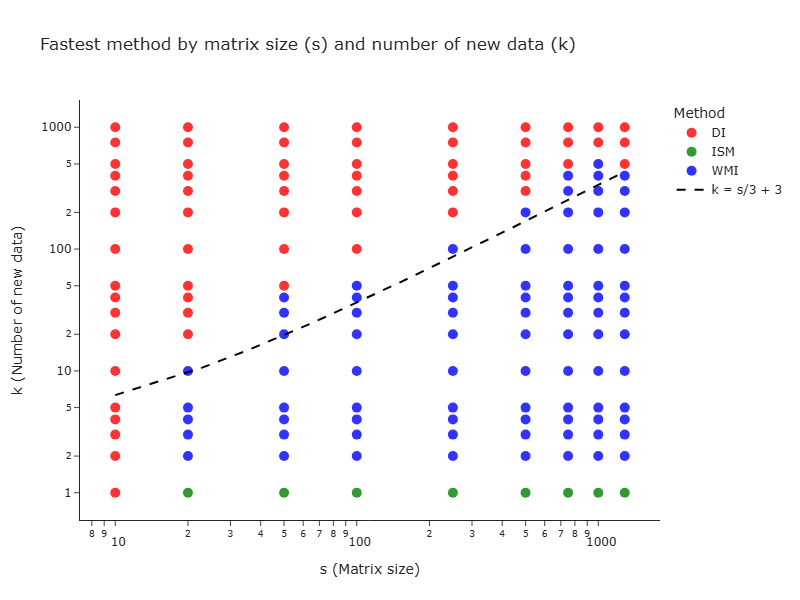

# Cost Trade-offs in Matrix Inversion Updates for Streaming Outlier Detection <!-- omit from toc -->


## Overview

This repository provides all necessary code and resources to reproduce the theoretical and empirical results presented in our article. The implementation includes:
- Theoretical equation calculations
- Experimental implementations of DI, ISM, and WMI methods
- Result visualization tools

## Table of Contents <!-- omit from toc -->
- [Overview](#overview)
- [Main results](#main-results)
- [Installation](#installation)
- [Usage](#usage)
  - [Theoretical results](#theoretical-results)
  - [Experimental results](#experimental-results)
    - [Running the experiments](#running-the-experiments)
    - [Function Parameters](#function-parameters)
    - [Output](#output)
  - [Plotting the results](#plotting-the-results)
- [Citation](#citation)


## Main results



The above image illustrates the fastest method to update the inverse of a matrix of size $s$ with $k$ new data. ISM is faster for a rank-1 update (i.e. $k=1$). Then the WMI method is faster for a rank-$k$ update when $k < s/3$, and finally, for a large update, the DI method is superior.


## Installation

1. Clone the repository
    ```bash
    git clone https://github.com/fgrivet/cost-trade-offs-matrix-inversion-update.git
    ```
2. Install the dependencies
    ```bash
    pip install -r requirements.txt
    ```

## Usage

### Theoretical results

The theoretical equations and plots from the article are implemented in:
- `theoretical_plot.ipynb`

This notebook contains:
- Implementation of theoretical models
- Generation of theoretical plots
- Calculation of theoretical thresholds for k with s fixed to 1287


### Experimental results

#### Running the experiments

To run the experiments, execute one of the following commands:

```sh
python main.py
# OR for grid search
python main_grid_search.py
```

The `main.py` script contains the `main()` function which:
- Measures execution time
- Calculates the Frobenius norm
- Compares DI, ISM, and WMI methods

#### Function Parameters

```py
def main(S: int, ns: int, s: int, k_list: list[int]):
    """Compare the DI, ISM, and WMI methods in terms of execution time and norm of the error
    Save the results in f"results/result_{s}.csv"

    Parameters
    ----------
    S : int
        Number of samples
    ns : int
        Number of simulations for each method and k value
    s : int
        Matrix size
    k_list : list[int]
        The number of new data points to increment
    """
```

#### Output

The results of this function will be saved in `results/result_{s}.csv` in CSV format.


### Plotting the results

The empirical results visualization is implemented in:
- `empirical_plot.ipynb`

This notebook contains code to generate all plots presented in the experimental results section of the article.


## Citation

If you use this code or reference our work in your research, please cite our article:

```

```

